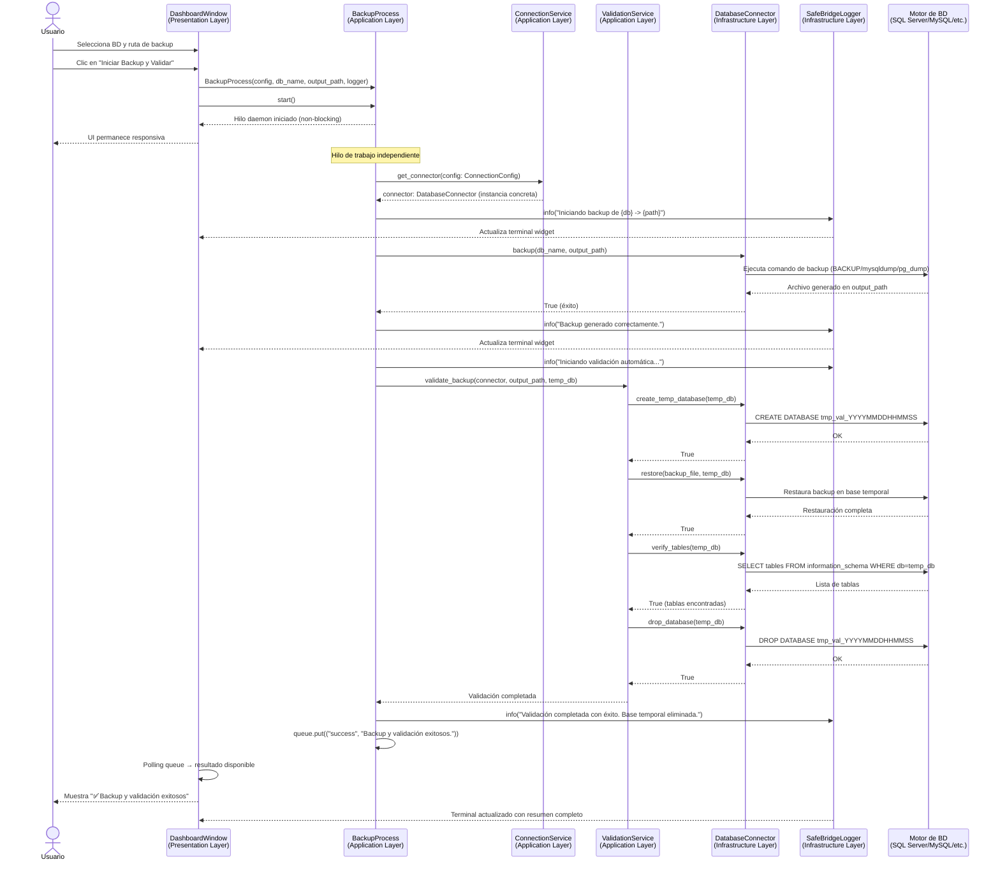
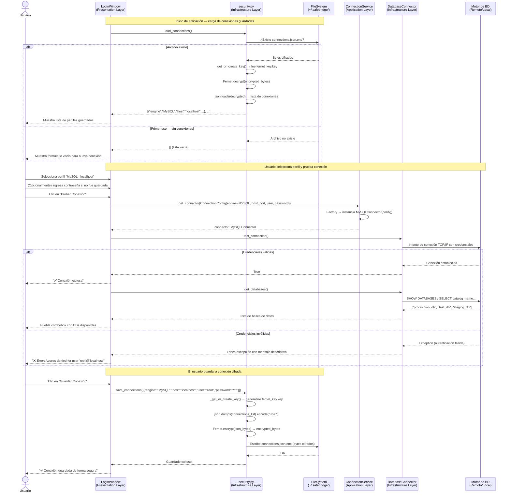

<center>


**UNIVERSIDAD PRIVADA DE TACNA**

**FACULTAD DE INGENIERÍA**

**Escuela Profesional de Ingeniería de Sistemas**

**Proyecto: *SafeBridge: Orquestador Multi-Motor de Respaldos y Validación de Integridad***

Curso: *Base de Datos II*

Docente: *Ing. Patrick José Cuadros Quiroga*

Integrantes:

***Sierra Ruiz, Iker Alberto (2023077090)***

***Cortez Mamani, Julio Samuel (2023077283)***

**Empresa / Equipo: BitCraft Solutions**

**Tacna – Perú**

***2026***

</center>

<div style="page-break-after: always; visibility: hidden"></div>

**Sistema: *SafeBridge: Orquestador Multi-Motor de Respaldos y Validación de Integridad***

**Informe FD03 — Historias de Usuario, Criterios de Aceptación y Diagramas de Secuencia**

**Versión *1.0***

| CONTROL DE VERSIONES | | | | | |
|:---:|---|---|---|---|---|
| Versión | Hecha por | Revisada por | Aprobada por | Fecha | Motivo |
| 1.0 | IASR / JSCM | Ing. P. Cuadros | Ing. P. Cuadros | 06/05/2026 | Versión Original |

<div style="page-break-after: always; visibility: hidden"></div>

---

# ÍNDICE GENERAL

1. [Gestión de Issues — Historias de Usuario](#1-gestión-de-issues--historias-de-usuario)
2. [Criterios de Aceptación y Escenarios de Prueba (Gherkin)](#2-criterios-de-aceptación-y-escenarios-de-prueba-gherkin)
   - [HU-01: Configurar Conexión a Motor de Base de Datos](#hu-01-configurar-conexión-a-motor-de-base-de-datos)
   - [HU-02: Ejecutar Backup con Validación Automática](#hu-02-ejecutar-backup-con-validación-automática)
   - [HU-03: Validar Integridad en Base Temporal](#hu-03-validar-integridad-en-base-temporal)
   - [HU-04: Consultar Historial de Operaciones](#hu-04-consultar-historial-de-operaciones)
   - [HU-05: Gestionar Credenciales de Forma Segura](#hu-05-gestionar-credenciales-de-forma-segura)
3. [Diagramas de Secuencia](#3-diagramas-de-secuencia)
   - [3.1 Flujo Completo: Backup y Validación Temporal](#31-flujo-completo-backup-y-validación-temporal)
   - [3.2 Flujo de Conexión Segura y Validación de Credenciales Cifradas](#32-flujo-de-conexión-segura-y-validación-de-credenciales-cifradas)
4. [Conclusiones](#4-conclusiones)

<div style="page-break-after: always; visibility: hidden"></div>

---

## 1. Gestión de Issues — Historias de Usuario

Las historias de usuario representan los requisitos funcionales del sistema desde la perspectiva del usuario final. Cada historia sigue el formato canónico de la metodología ágil: **Como [rol]... Quiero [acción]... Para [resultado].**

---

### HU-01 — Configurar Conexión a Motor de Base de Datos

> **Como** administrador de base de datos,
> **Quiero** poder configurar y guardar una conexión a cualquiera de los cinco motores de base de datos soportados (SQL Server, MySQL, PostgreSQL, Oracle, SQLite),
> **Para** poder seleccionar el motor apropiado según el entorno de trabajo sin necesidad de re-ingresar las credenciales en cada sesión.

**Prioridad:** Alta  
**Milestone:** v1.0  
**Labels:** `feature`, `infrastructure`

---

### HU-02 — Ejecutar Backup con Validación Automática

> **Como** administrador de base de datos,
> **Quiero** poder iniciar el proceso de backup de una base de datos seleccionada especificando la ruta de destino,
> **Para** obtener un archivo de respaldo validado que garantice su restaurabilidad, con registro completo del proceso en el terminal de la aplicación.

**Prioridad:** Alta  
**Milestone:** v1.0  
**Labels:** `feature`, `backup`

---

### HU-03 — Validar Integridad en Base Temporal (Sandbox)

> **Como** DBA (Administrador de Base de Datos),
> **Quiero** que el sistema restaure automáticamente el archivo de backup en una base de datos temporal y verifique la presencia e integridad de sus tablas,
> **Para** tener certeza científica de que el backup es funcional y restaurable antes de depender de él en un escenario de recuperación ante desastres.

**Prioridad:** Alta  
**Milestone:** v1.0  
**Labels:** `feature`, `validation`, `security`

---

### HU-04 — Consultar Historial y Logs de Operaciones

> **Como** auditor de sistemas o administrador de TI,
> **Quiero** poder visualizar el historial de todas las operaciones de backup y validación ejecutadas, con su resultado (EXITOSO / ERROR / VALIDADO), marca de tiempo y detalle del log,
> **Para** disponer de trazabilidad completa de las actividades de respaldo y poder demostrar el cumplimiento de políticas de continuidad del negocio.

**Prioridad:** Media  
**Milestone:** v1.0  
**Labels:** `feature`, `audit`, `logging`

---

### HU-05 — Gestionar Credenciales de Forma Segura

> **Como** usuario de SafeBridge,
> **Quiero** que mis credenciales de conexión (usuario, contraseña, host, puerto) se almacenen de forma cifrada en mi equipo y sean recuperadas automáticamente al iniciar la aplicación,
> **Para** no tener que re-ingresar contraseñas en cada sesión y tener la garantía de que mis credenciales no se exponen en texto plano en el sistema de archivos.

**Prioridad:** Alta  
**Milestone:** v1.0  
**Labels:** `security`, `feature`

---

<div style="page-break-after: always; visibility: hidden"></div>

## 2. Criterios de Aceptación y Escenarios de Prueba (Gherkin)

Los escenarios de prueba se redactan en lenguaje **Gherkin** (Given-When-Then), que sirve tanto como documentación de requisitos como base para pruebas de aceptación automatizadas con frameworks como `behave` (Python).

---

### HU-01: Configurar Conexión a Motor de Base de Datos

**Escenario 1: Conexión exitosa a MySQL**

```gherkin
Feature: Configuración de conexión a motor de base de datos

  Scenario: Conexión exitosa a MySQL con credenciales válidas
    DADO que el usuario ha seleccionado el motor "MySQL"
      Y ha ingresado el host "localhost", puerto "3306",
        usuario "root" y contraseña válida
    CUANDO hace clic en el botón "Probar Conexión"
    ENTONCES el sistema muestra el mensaje "Conexión exitosa"
      Y el botón "Guardar Conexión" se habilita
      Y el combobox de bases de datos se puebla con las BDs disponibles
```

**Escenario 2: Fallo de conexión por credenciales incorrectas**

```gherkin
  Scenario: Fallo de conexión por contraseña incorrecta
    DADO que el usuario ha seleccionado el motor "PostgreSQL"
      Y ha ingresado credenciales con contraseña incorrecta
    CUANDO hace clic en el botón "Probar Conexión"
    ENTONCES el sistema muestra un mensaje de error descriptivo
      Y el terminal widget registra el error con nivel "ERROR"
      Y el botón "Guardar Conexión" permanece deshabilitado
```

**Escenario 3: Conexión a SQLite mediante ruta de archivo**

```gherkin
  Scenario: Conexión exitosa a SQLite mediante ruta de archivo
    DADO que el usuario ha seleccionado el motor "SQLite"
      Y ha especificado la ruta "/home/user/data/mydb.sqlite"
    CUANDO hace clic en el botón "Probar Conexión"
    ENTONCES el sistema verifica que el archivo existe y es un SQLite válido
      Y muestra "Conexión exitosa" con el nombre del archivo
```

---

### HU-02: Ejecutar Backup con Validación Automática

**Escenario 1: Backup exitoso con validación**

```gherkin
Feature: Ejecución de backup y validación automática

  Scenario: Backup y validación exitosos en MySQL
    DADO que el usuario tiene una conexión activa al motor "MySQL"
      Y ha seleccionado la base de datos "produccion_db"
      Y ha especificado la ruta de destino "C:/backups/"
    CUANDO hace clic en el botón "Iniciar Backup y Validar"
    ENTONCES el sistema ejecuta el backup en un hilo separado
      Y el terminal widget muestra en tiempo real los pasos del proceso
      Y al finalizar muestra el mensaje "Backup y validación exitosos"
      Y el archivo de backup es generado en la ruta especificada
      Y el estado se registra como "VALIDADO" en el historial
```

**Escenario 2: Error por espacio insuficiente en disco**

```gherkin
  Scenario: Error de backup por espacio insuficiente
    DADO que el usuario intenta realizar un backup de una base de datos grande
      Y la ruta de destino tiene menos de 500 MB libres
    CUANDO el proceso de backup se ejecuta
    ENTONCES el sistema captura la excepción de escritura
      Y registra el error en el log con nivel "ERROR"
      Y la cola de eventos devuelve el estado ("error", mensaje_descriptivo)
      Y la UI notifica al usuario del fallo sin colgarse ni congelarse
```

**Escenario 3: Backup ejecutado de forma no bloqueante**

```gherkin
  Scenario: La UI permanece responsiva durante el backup
    DADO que el usuario ha iniciado un proceso de backup de larga duración
    CUANDO el proceso está en ejecución en el hilo de trabajo
    ENTONCES el usuario puede seguir interactuando con otros elementos de la UI
      Y el terminal widget actualiza los mensajes de progreso en tiempo real
      Y no se produce ningún congelamiento ("freezing") de la interfaz
```

---

### HU-03: Validar Integridad en Base Temporal (Sandbox)

**Escenario 1: Validación completa exitosa**

```gherkin
Feature: Validación de integridad en base de datos temporal

  Scenario: Validación exitosa de backup en sandbox
    DADO que existe un archivo de backup válido en la ruta especificada
      Y el motor de base de datos está disponible para restauración
    CUANDO ValidationService.validate_backup() es invocado
    ENTONCES el sistema crea la base temporal con nombre "tmp_val_YYYYMMDDHHMMSS"
      Y restaura el backup en dicha base temporal
      Y ejecuta verify_tables() comprobando que la base contiene al menos una tabla
      Y elimina la base temporal con drop_database()
      Y devuelve el resultado de validación al proceso padre
```

**Escenario 2: Backup corrupto detectado**

```gherkin
  Scenario: Detección de backup corrupto durante la restauración
    DADO que el archivo de backup está dañado o es incompleto
    CUANDO ValidationService intenta restaurarlo en la base temporal
    ENTONCES el conector lanza una excepción durante el proceso de restore
      Y el sistema registra el error con nivel "ERROR" indicando "Backup no restaurable"
      Y la base temporal es eliminada si fue creada parcialmente
      Y el estado del BackupRecord se marca como "ERROR"
```

**Escenario 3: Base temporal sin tablas (backup vacío)**

```gherkin
  Scenario: Backup restaurado pero sin estructura de tablas
    DADO que el backup fue generado de una base de datos vacía
    CUANDO verify_tables() es ejecutado sobre la base temporal
    ENTONCES el método devuelve False
      Y el sistema registra "WARNING: base temporal restaurada sin tablas detectadas"
      Y el estado del BackupRecord se marca con detalle de la anomalía
```

---

### HU-04: Consultar Historial y Logs de Operaciones

**Escenario 1: Visualización de historial de backups**

```gherkin
Feature: Consulta de historial y logs de operaciones

  Scenario: El usuario consulta el historial de backups exitosos
    DADO que se han ejecutado al menos tres procesos de backup en sesiones anteriores
      Y los registros fueron guardados en el sistema de log
    CUANDO el usuario accede a la sección de historial en el dashboard
    ENTONCES el sistema muestra una lista de registros con:
        | Campo       | Ejemplo                         |
        | Base de datos | produccion_db                 |
        | Motor       | MySQL                           |
        | Ruta        | C:/backups/produccion_20260506.sql |
        | Timestamp   | 2026-05-06 14:32:00             |
        | Estado      | VALIDADO                        |
```

**Escenario 2: Filtrado de logs por nivel de severidad**

```gherkin
  Scenario: El usuario filtra el terminal widget por nivel ERROR
    DADO que el terminal widget muestra mensajes de nivel INFO, WARNING y ERROR
    CUANDO el usuario selecciona el filtro "ERROR" en el panel de logs
    ENTONCES el terminal widget solo muestra las líneas de nivel ERROR
      Y las líneas de INFO y WARNING quedan ocultas temporalmente
```

**Escenario 3: Log con marca de tiempo precisa**

```gherkin
  Scenario: Cada entrada de log incluye marca de tiempo
    DADO que SafeBridgeLogger está inicializado correctamente
    CUANDO se registra cualquier evento mediante logger.info(), logger.error()
    ENTONCES la entrada en el archivo de log contiene timestamp con formato
      "YYYY-MM-DD HH:MM:SS.mmm [NIVEL] mensaje"
      Y el archivo se encuentra en el directorio "~/.safebridge/logs/"
```

---

### HU-05: Gestionar Credenciales de Forma Segura

**Escenario 1: Primera ejecución — generación de clave Fernet**

```gherkin
Feature: Gestión segura de credenciales con cifrado Fernet

  Scenario: Primera ejecución genera clave Fernet automáticamente
    DADO que el archivo "~/.safebridge/fernet_key.key" no existe
    CUANDO la aplicación es iniciada por primera vez
    ENTONCES el sistema genera una clave Fernet de 32 bytes codificada en Base64
      Y la persiste en "~/.safebridge/fernet_key.key" con permisos restrictivos
      Y el directorio "~/.safebridge/" es creado si no existe
```

**Escenario 2: Guardar y recuperar conexión cifrada**

```gherkin
  Scenario: Guardar conexión y recuperarla en siguiente sesión
    DADO que el usuario ha configurado una conexión válida a PostgreSQL
    CUANDO hace clic en "Guardar Conexión"
    ENTONCES el sistema cifra las credenciales con Fernet
      Y persiste el resultado en "~/.safebridge/connections.json.enc"
      Y al reiniciar la aplicación las conexiones guardadas aparecen disponibles
      Y las contraseñas no son legibles inspeccionando el archivo .enc directamente
```

**Escenario 3: Manejo de clave corrupta o archivo inexistente**

```gherkin
  Scenario: Manejo graceful de archivo de conexiones dañado
    DADO que el archivo "~/.safebridge/connections.json.enc" está corrupto
    CUANDO la aplicación intenta cargar las conexiones guardadas
    ENTONCES load_connections() captura la excepción de descifrado
      Y devuelve una lista vacía sin lanzar error al usuario
      Y el terminal widget registra un WARNING informando del evento
```

<div style="page-break-after: always; visibility: hidden"></div>

---

## 3. Diagramas de Secuencia

### 3.1 Flujo Completo: Backup y Validación Temporal

El siguiente diagrama ilustra el flujo completo desde que el usuario solicita un backup hasta que el sistema valida la integridad en la base temporal y devuelve el resultado.



---

### 3.2 Flujo de Conexión Segura y Validación de Credenciales Cifradas

El siguiente diagrama muestra el flujo de autenticación segura, incluyendo la carga y descifrado de credenciales con Fernet, y la validación de la conexión al motor de base de datos seleccionado.



<div style="page-break-after: always; visibility: hidden"></div>

---

## 4. Conclusiones

Las cinco historias de usuario definidas en este documento cubren el núcleo funcional de SafeBridge, abordando los flujos críticos de conexión, backup, validación, auditoría y seguridad. La especificación en formato Gherkin permite que estos requisitos sean directamente ejecutables como pruebas de aceptación automatizadas mediante herramientas como `behave` en Python, facilitando la integración con el pipeline de CI/CD.

Los diagramas de secuencia revelan la correcta implementación de los principios de Clean Architecture: la capa de presentación no interactúa directamente con la infraestructura de base de datos; toda comunicación pasa por los servicios de aplicación (`BackupProcess`, `ConnectionService`, `ValidationService`) que delegan en los conectores concretos a través de la interfaz abstracta `DatabaseConnector`. La comunicación asíncrona mediante `threading.Thread` y `queue.Queue` garantiza que la experiencia de usuario no se vea comprometida durante operaciones de larga duración.

El flujo de seguridad muestra cómo el cifrado Fernet actúa como capa defensiva transversal, garantizando que las credenciales nunca se expongan en texto claro, incluso en caso de acceso no autorizado al sistema de archivos del usuario.

---

*Documento generado por el equipo BitCraft Solutions — Universidad Privada de Tacna, FAING-EPIS, Ciclo 2026-I.*
