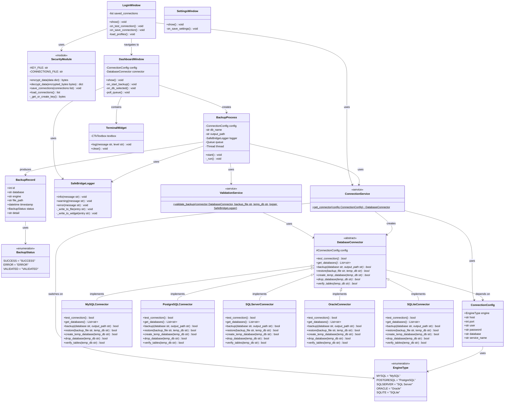
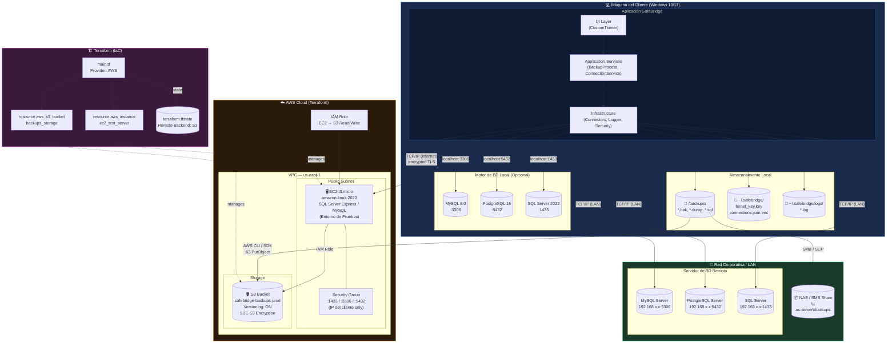

<center>


**UNIVERSIDAD PRIVADA DE TACNA**

**FACULTAD DE INGENIERÍA**

**Escuela Profesional de Ingeniería de Sistemas**

**Proyecto: *SafeBridge: Orquestador Multi-Motor de Respaldos y Validación de Integridad***

Curso: *Base de Datos II*

Docente: *Ing. Patrick José Cuadros Quiroga*

Integrantes:

***Sierra Ruiz, Iker Alberto (2023077090)***

***Cortez Mamani, Julio Samuel (2023077283)***

**Empresa / Equipo: BitCraft Solutions**

**Tacna – Perú**

***2026***

</center>

<div style="page-break-after: always; visibility: hidden"></div>

**Sistema: *SafeBridge: Orquestador Multi-Motor de Respaldos y Validación de Integridad***

**Informe FD04 — Ingeniería Inversa y Diagramas Estructurales**

**Versión *1.0***

| CONTROL DE VERSIONES | | | | | |
|:---:|---|---|---|---|---|
| Versión | Hecha por | Revisada por | Aprobada por | Fecha | Motivo |
| 1.0 | IASR / JSCM | Ing. P. Cuadros | Ing. P. Cuadros | 06/05/2026 | Versión Original |

<div style="page-break-after: always; visibility: hidden"></div>

---

# ÍNDICE GENERAL

1. [Introducción — Ingeniería Inversa sobre SafeBridge](#1-introducción--ingeniería-inversa-sobre-safebridge)
2. [Diagrama de Clases](#2-diagrama-de-clases)
3. [Diagrama de Base de Datos (Modelo Interno SQLite)](#3-diagrama-de-base-de-datos-modelo-interno-sqlite)
4. [Diagrama de Componentes](#4-diagrama-de-componentes)
5. [Diagrama de Despliegue, Arquitectura e Infraestructura](#5-diagrama-de-despliegue-arquitectura-e-infraestructura)
6. [Conclusiones](#6-conclusiones)

<div style="page-break-after: always; visibility: hidden"></div>

---

## 1. Introducción — Ingeniería Inversa sobre SafeBridge

La **Ingeniería Inversa de Software** es el proceso de analizar un sistema existente para identificar sus componentes, relaciones, comportamientos y estructura arquitectónica, con el fin de producir documentación de alto nivel que facilite la comprensión, mantenimiento y evolución del sistema.

En el caso de **SafeBridge**, se ha realizado un proceso de ingeniería inversa sobre el código fuente Python organizado en cuatro capas de Clean Architecture:

| Capa | Paquete | Responsabilidad |
|------|---------|-----------------|
| **Presentación** | `presentation/` | Interfaz gráfica (CustomTkinter). Ventanas y widgets. |
| **Aplicación** | `application/services/` | Casos de uso y orquestación de procesos. |
| **Dominio** | `domain/` | Entidades, modelos y reglas de negocio puras. |
| **Infraestructura** | `infrastructure/` | Conectores de BD, logging, seguridad/cifrado. |

A partir del análisis del código fuente, se han derivado los siguientes diagramas estructurales y de despliegue, documentados en formato **Mermaid** para máxima portabilidad y renderizado nativo en GitHub.

<div style="page-break-after: always; visibility: hidden"></div>

---

## 2. Diagrama de Clases

Este diagrama muestra las interfaces abstractas, las clases concretas derivadas, y los modelos de dominio del sistema SafeBridge. Refleja fielmente la estructura encontrada en el código fuente mediante análisis de ingeniería inversa.



<div style="page-break-after: always; visibility: hidden"></div>

---

## 3. Diagrama de Base de Datos (Modelo Interno SQLite)

SafeBridge en su versión actual utiliza el sistema de archivos y la capa de logging para persistencia. Sin embargo, en versiones futuras (v1.1+) se contempla una base de datos **SQLite** interna para almacenar el historial de operaciones de backup. El siguiente diagrama modela el esquema relacional propuesto para dicho registro histórico.

```mermaid
erDiagram
    CONNECTION_PROFILES {
        INTEGER id PK "AUTO INCREMENT"
        TEXT engine NOT_NULL "MySQL|PostgreSQL|SQL Server|Oracle|SQLite"
        TEXT alias NOT_NULL "Nombre amigable del perfil"
        TEXT host NOT_NULL
        INTEGER port NOT_NULL
        TEXT username NOT_NULL
        TEXT encrypted_password NOT_NULL "Cifrado con Fernet"
        TEXT database_name
        TEXT service_name "Solo Oracle"
        DATETIME created_at NOT_NULL
        DATETIME last_used_at
    }

    BACKUP_RECORDS {
        INTEGER id PK "AUTO INCREMENT"
        INTEGER profile_id FK
        TEXT database_name NOT_NULL "Nombre de la BD respaldada"
        TEXT engine NOT_NULL "Motor de BD"
        TEXT file_path NOT_NULL "Ruta absoluta del archivo de backup"
        INTEGER file_size_bytes "Tamaño del archivo generado"
        DATETIME started_at NOT_NULL
        DATETIME finished_at
        TEXT status NOT_NULL "SUCCESS|ERROR|VALIDATED"
        TEXT detail "Mensaje descriptivo del resultado"
    }

    VALIDATION_RECORDS {
        INTEGER id PK "AUTO INCREMENT"
        INTEGER backup_id FK
        TEXT temp_db_name NOT_NULL "Nombre de la BD temporal usada"
        DATETIME started_at NOT_NULL
        DATETIME finished_at
        BOOLEAN create_temp_ok NOT_NULL "create_temp_database() resultado"
        BOOLEAN restore_ok NOT_NULL "restore() resultado"
        BOOLEAN verify_tables_ok NOT_NULL "verify_tables() resultado"
        BOOLEAN drop_temp_ok NOT_NULL "drop_database() resultado"
        TEXT error_message "NULL si todo fue exitoso"
    }

    LOG_ENTRIES {
        INTEGER id PK "AUTO INCREMENT"
        INTEGER backup_id FK "NULL si log general"
        TEXT level NOT_NULL "INFO|WARNING|ERROR"
        TEXT message NOT_NULL
        DATETIME timestamp NOT_NULL
    }

    APP_SETTINGS {
        TEXT key PK "Clave de configuración"
        TEXT value NOT_NULL "Valor de configuración"
        TEXT description
        DATETIME updated_at NOT_NULL
    }

    CONNECTION_PROFILES ||--o{ BACKUP_RECORDS : "genera"
    BACKUP_RECORDS ||--o| VALIDATION_RECORDS : "tiene"
    BACKUP_RECORDS ||--o{ LOG_ENTRIES : "produce"
```

### Descripción de las Tablas

| Tabla | Propósito |
|-------|-----------|
| `CONNECTION_PROFILES` | Almacena los perfiles de conexión cifrados del usuario. La contraseña se persiste cifrada con Fernet. |
| `BACKUP_RECORDS` | Registro histórico de cada operación de backup ejecutada, con su estado final y ruta del archivo. |
| `VALIDATION_RECORDS` | Detalle de cada paso de la validación temporal (create, restore, verify, drop) con indicadores booleanos de éxito. |
| `LOG_ENTRIES` | Entradas de log estructuradas, vinculadas opcionalmente a una operación de backup específica. |
| `APP_SETTINGS` | Configuración persistente de la aplicación (rutas por defecto, política de retención, tema visual, etc.). |

<div style="page-break-after: always; visibility: hidden"></div>

---

## 4. Diagrama de Componentes

Este diagrama muestra la estructura de componentes de SafeBridge y cómo interactúan entre sí, respetando la dirección de dependencias de Clean Architecture (de afuera hacia adentro).

```mermaid
graph TB
    subgraph PRESENTATION ["🖥️ Presentation Layer"]
        LW["LoginWindow\n(login_window.py)"]
        DW["DashboardWindow\n(dashboard_window.py)"]
        SW["SettingsWindow\n(settings_window.py)"]
        TW["TerminalWidget\n(terminal_widget.py)"]
    end

    subgraph APPLICATION ["⚙️ Application Layer"]
        BP["BackupProcess\n(backup_service.py)"]
        CS["ConnectionService\n(connection_service.py)"]
        VS["ValidationService\n(validation_service.py)"]
    end

    subgraph DOMAIN ["📦 Domain Layer"]
        CM["ConnectionConfig\n(models.py)"]
        BR["BackupRecord\n(models.py)"]
        ET["EngineType\n(models.py)"]
        BS["BackupStatus\n(models.py)"]
    end

    subgraph INFRASTRUCTURE ["🔧 Infrastructure Layer"]
        subgraph CONNECTORS ["Connectors"]
            ABC["DatabaseConnector\n(base_connector.py)"]
            MYS["MySQLConnector\n(mysql_connector.py)"]
            PGS["PostgreSQLConnector\n(postgresql_connector.py)"]
            SQL["SQLServerConnector\n(sqlserver_connector.py)"]
            ORA["OracleConnector\n(oracle_connector.py)"]
            SLT["SQLiteConnector\n(sqlite_connector.py)"]
        end
        LOG["SafeBridgeLogger\n(logger.py)"]
        SEC["SecurityModule\n(security.py)"]
    end

    subgraph EXTERNAL ["🌐 Sistemas Externos"]
        MySQL[("MySQL Server")]
        PostgreSQL[("PostgreSQL Server")]
        SQLServer[("SQL Server")]
        Oracle[("Oracle DB")]
        SQLite[("SQLite File")]
        FS["Sistema de Archivos\n(backups, logs, keys)"]
    end

    %% Presentation → Application
    LW -->|"get_connector()"| CS
    LW -->|"load/save connections"| SEC
    DW -->|"BackupProcess()"| BP
    DW -->|"contains"| TW

    %% Application → Domain
    BP -->|"uses"| CM
    BP -->|"produces"| BR
    CS -->|"uses"| ET
    CS -->|"uses"| CM

    %% Application → Infrastructure
    BP -->|"get_connector()"| CS
    BP -->|"validate_backup()"| VS
    BP -->|"log events"| LOG
    CS -->|"instantiates"| ABC
    VS -->|"uses"| ABC

    %% Infrastructure — Connectors → External
    MYS -->|"TCP/3306"| MySQL
    PGS -->|"TCP/5432"| PostgreSQL
    SQL -->|"ODBC/1433"| SQLServer
    ORA -->|"TCP/1521 TNS"| Oracle
    SLT -->|"File I/O"| SQLite

    ABC <|-- MYS
    ABC <|-- PGS
    ABC <|-- SQL
    ABC <|-- ORA
    ABC <|-- SLT

    %% Infrastructure → External FS
    LOG -->|"write logs"| FS
    SEC -->|"read/write\nencrypted files"| FS

    %% Style
    style PRESENTATION fill:#1e3a5f,color:#fff,stroke:#4a9eff
    style APPLICATION fill:#1e4a2e,color:#fff,stroke:#4aff7a
    style DOMAIN fill:#4a2e1e,color:#fff,stroke:#ff9a4a
    style INFRASTRUCTURE fill:#2e1e4a,color:#fff,stroke:#9a4aff
    style EXTERNAL fill:#2a2a2a,color:#ccc,stroke:#666
```

<div style="page-break-after: always; visibility: hidden"></div>

---

## 5. Diagrama de Despliegue, Arquitectura e Infraestructura

Este diagrama de despliegue muestra la topología física y lógica del sistema SafeBridge en sus diferentes escenarios de uso: entorno local, entorno en red corporativa y entorno cloud con Terraform.



### Descripción de los Nodos de Despliegue

| Nodo | Tecnología | Función |
|------|-----------|---------|
| **Máquina del Cliente** | Windows 10/11, Python 3.12+ | Ejecuta la aplicación SafeBridge localmente. |
| **Motor de BD Local** | SQL Server/MySQL/PostgreSQL instalados | Base de datos de producción local para backup. |
| **Servidor de BD Remoto** | Servidor en red LAN corporativa | BD de producción remota accesible por TCP/IP. |
| **NAS / SMB Share** | Servidor de archivos en red | Almacenamiento compartido para backups en red local. |
| **EC2 t3.micro** | Amazon Linux 2023, motor de BD | Servidor de BD en nube para pruebas de restauración remotas. |
| **S3 Bucket** | AWS S3 con SSE y versionado | Repositorio de backups validados en nube con durabilidad 99.999999999%. |
| **Terraform** | HashiCorp Terraform v1.7+ | Define y aprovisiona la infraestructura AWS como código (IaC). |

<div style="page-break-after: always; visibility: hidden"></div>

---

## 6. Conclusiones

El proceso de ingeniería inversa aplicado al código fuente de SafeBridge ha permitido documentar con precisión la arquitectura real del sistema, evidenciando la correcta aplicación de los principios de **Clean Architecture**:

1. **Diagrama de Clases:** Confirma la existencia de la interfaz abstracta `DatabaseConnector` con cinco implementaciones concretas, y los modelos de dominio `ConnectionConfig` y `BackupRecord` sin dependencias hacia capas externas.

2. **Diagrama de BD:** El modelo relacional propuesto para la versión v1.1 con SQLite refleja la necesidad de trazabilidad completa: perfiles de conexión cifrados, registros de backup, validaciones paso a paso y logs estructurados.

3. **Diagrama de Componentes:** Evidencia el respeto estricto de la **Regla de Dependencia**: Presentación → Aplicación → Dominio ← Infraestructura, con la capa de dominio completamente libre de dependencias externas.

4. **Diagrama de Despliegue:** Muestra la flexibilidad de SafeBridge para operar en múltiples topologías: escritorio local, red corporativa con servidor remoto, y entorno cloud AWS con infraestructura definida mediante Terraform (IaC), garantizando reproducibilidad y control de costos.

La combinación de estos cuatro diagramas estructurales constituye la documentación técnica completa de la arquitectura de SafeBridge, suficiente para que cualquier nuevo desarrollador pueda entender, mantener y extender el sistema sin necesidad de leer cada línea de código fuente.

---

*Documento generado por el equipo BitCraft Solutions — Universidad Privada de Tacna, FAING-EPIS, Ciclo 2026-I.*
